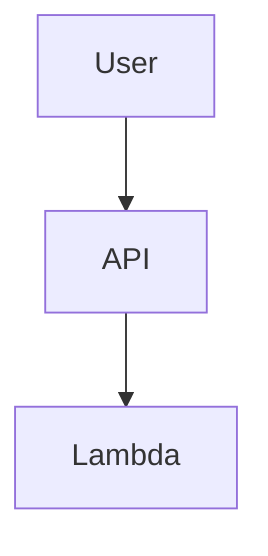
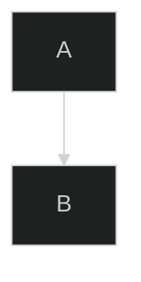

# EcoBid Architecture Diagrams Catalog

This directory contains all architecture diagrams for the EcoBid marketplace in multiple formats for different tools and use cases.

## Diagram Formats

### Mermaid (.mmd)
- **Best for:** GitHub README, GitLab, documentation sites
- **Rendering:** GitHub natively renders Mermaid in markdown
- **Tools:** Mermaid Live Editor, VS Code extensions

### PlantUML (.puml)
- **Best for:** Professional documentation, enterprise tools
- **Rendering:** PlantUML server, VS Code extensions, IntelliJ
- **Tools:** PlantUML online server, local Java installation

## Available Diagrams

### 1. High-Level Architecture
- **Files:** `01_high_level_architecture.mmd`, `01_high_level_architecture.puml`
- **Description:** Complete system overview showing all AWS services and connections
- **Use Case:** Competition submission, technical presentations

### 2. AI Processing Flow
- **Files:** `02_ai_processing_flow.mmd`, `02_ai_processing_flow.puml`
- **Description:** Sequence diagram showing photo upload and AI analysis workflow
- **Use Case:** Technical deep-dive, AI integration documentation

### 3. Lottery System Flow
- **Files:** `03_lottery_system_flow.mmd`, `03_lottery_system_flow.puml`
- **Description:** Event-driven lottery and reservation system workflow
- **Use Case:** Business logic documentation, system behavior explanation

### 4. DynamoDB Schema
- **Files:** `04_dynamodb_schema.mmd`, `04_dynamodb_schema.puml`
- **Description:** Single-table design with GSI patterns and access patterns
- **Use Case:** Database design documentation, developer onboarding

### 5. Security Architecture
- **Files:** `05_security_architecture.mmd`, `05_security_architecture.puml`
- **Description:** IAM roles, permissions, and security boundaries
- **Use Case:** Security review, compliance documentation

### 6. Deployment Pipeline
- **Files:** `06_deployment_pipeline.mmd`, `06_deployment_pipeline.puml`
- **Description:** CI/CD workflow from development to production
- **Use Case:** DevOps documentation, deployment process

## Usage Instructions

### GitHub/GitLab Markdown
```markdown


### PlantUML Online
1. Visit http://www.plantuml.com/plantuml/uml/
2. Copy content from `.puml` files
3. Generate PNG/SVG exports

### VS Code Extensions
- **Mermaid:** "Mermaid Markdown Syntax Highlighting"
- **PlantUML:** "PlantUML" extension with Java runtime

### Draw.io/Lucidchart Import
- Use PlantUML format for better compatibility
- Some manual adjustment may be needed for styling

## Export Formats

Each diagram can be exported to:
- **PNG:** High-resolution images for presentations
- **SVG:** Vector graphics for scalable documentation
- **PDF:** Print-ready documentation
- **HTML:** Interactive web documentation

## Customization

### Mermaid Themes


### PlantUML Styling
```plantuml
@startuml
!theme plain
skinparam backgroundColor white
@enduml
```

## Integration with Documentation Tools

### Confluence
- Use PlantUML macro for live diagrams
- Upload PNG exports for static documentation

### Notion
- Export as PNG/SVG for embedding
- Use Mermaid blocks in Notion (limited support)

### Sphinx/MkDocs
- Use mermaid-sphinx extension
- Include diagrams directly in RST/Markdown

---

*All diagrams represent the EcoBid infrastructure as deployed for the AWS 10,000 AIdeas competition.*
